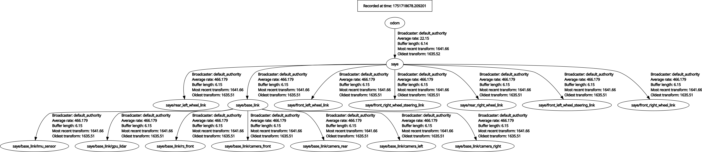

# Ackermann Steering Vehicle Simulation in ROS2 with Gazebo Sim Harmonic

This project features the simulation of a custom vehicle with **Ackermann steering capabilities**, developed using **ROS2** and the **Gazebo Sim Harmonic environment**. The model integrates a variety of sensors and navigation tools for autonomous operation, making it one of the first implementations of an Ackermann steering vehicle in this simulation framework.

## Features

### 1. **Ackermann Steering**

- A custom vehicle model built with realistic Ackermann steering dynamics for accurate maneuverability.

### 2. **ROS2 Communication**

- All sensor data and control signals are fully integrated into the ROS2 ecosystem for seamless interoperability.

### 3. **Sensors**

- **IMU**: Provides orientation and angular velocity.
- **Odometry**: Ensures accurate vehicle state feedback.
- **LiDAR**: Mounted for obstacle detection and environmental scanning.
- **Cameras**:
  - Front-facing
  - Rear-facing
  - Left-side
  - Right-side
  > **Note:** By default, only the front camera is bridged to ROS 2.If you want to use all cameras (left, right, rear) in ROS 2,remove the `#` at the beginning of the relevant camera sections in `saye_bringup/config/ros_gz_bridge.yaml` to activate them  (e.g., `/camera/left_raw`, `/camera/right_raw`, `/camera/rear_raw`).

### 4. **Navigation**

- Integrated with the **Nav2 stack** for autonomous navigation.
- **AMCL (Adaptive Monte Carlo Localization)** for improved positional accuracy.
- **SLAM** techniques implemented for real-time mapping and understanding of the environment.
- Fine-tuned parameters for optimized navigation performance.

### 5. **Manual Control (with external joystick)**

- Added support for joystick-based manual control in the simulation environment, enabling users to test vehicle movement interactively.

### 6. **Visualization**

- Full model and sensor data visualization in **RViz2**, providing insights into robot states and environmental feedback.

## Requirements

- **ROS2 (Humble)**
- **Gazebo Sim Harmonic**
- **RViz2**
- **Nav2**

## Installation

0. Your need to sure that installation of Gazebo Harmonic and ROS (ros_gz):<br>
   `sudo apt-get install ros-${ROS_DISTRO}-ros-gz`<br>
   `sudo apt-get install ros-humble-ros-gzharmonic` (Only Humble version)<br>
   More details about installation Gazebo and ROS: <a href="https://gazebosim.org/docs/latest/ros_installation/">Link</a>
1. Clone the repository:<br>
   `mkdir -p ackermann_sim/src && cd ackermann_sim/src`<br>
   `git clone https://github.com/alitekes1/ackermann-vehicle-gzsim-ros2`<br>`cd ..`
2. Build the project:
   `colcon build && source install/setup.bash`
3. Set environment variables:
   ```bash
   # Set environment variables for current session
   export GZ_SIM_RESOURCE_PATH=$GZ_SIM_RESOURCE_PATH:/your/path/ackermann_sim/src/ackermann-vehicle-gzsim-ros2/
   export ROS_PACKAGE_PATH=$ROS_PACKAGE_PATH:/your/path/ackermann_sim/src/ackermann-vehicle-gzsim-ros2/
   ```

   **For Permanent Setup:**
   
   To make these environment variables permanent, add them to your `.bashrc` file:
   ```bash
   # Add environment variables to .bashrc
   echo 'export GZ_SIM_RESOURCE_PATH=$GZ_SIM_RESOURCE_PATH:/your/path/ackermann_sim/src/ackermann-vehicle-gzsim-ros2/' >> ~/.bashrc
   echo 'export ROS_PACKAGE_PATH=$ROS_PACKAGE_PATH:/your/path/ackermann_sim/src/ackermann-vehicle-gzsim-ros2/' >> ~/.bashrc
   
   # Apply changes
   source ~/.bashrc
   ```

   > **Note:** Replace `/your/path/` with your actual installation path.

## Usage

### 1. Basic Simulation and Manual Control

1. Launch the simulation:  
   `ros2 launch saye_bringup saye_spawn.launch.py`

2. Control car:  
   `ros2 run teleop_twist_keyboard teleop_twist_keyboard`

### 2. SLAM (Simultaneous Localization and Mapping)

- To run SLAM Toolbox for mapping, launch the following after starting the simulation:

   `ros2 launch saye_bringup slam.launch.py`

<video src="saye_msgs/readme_files/saye_slam.mp4" controls="controls" muted="muted" autoplay="autoplay" loop="loop"></video>
### 3. Navigation with Nav2

- To run the simulation with the Nav2 stack for autonomous navigation, launch the following after starting the simulation:

   `ros2 launch saye_bringup navigation_bringup.launch.py`

<video src="saye_msgs/readme_files/saye_nav2.mp4" controls="controls" muted="muted" autoplay="autoplay" loop="loop"></video>

> **Note:** The videos above are played at 4x speed.

## Future Work

1. **Deep Reinforcement Learning (DRL):**
   - Train the vehicle to handle complex scenarios autonomously using advanced DRL algorithms.
2. **Enhanced Features:**
   - Explore additional sensor configurations and navigation strategies.

## Gallery


| **Gazebo Sim Harmonic**                                                                                                     | **RViz2**                                                                                                                   |
| --------------------------------------------------------------------------------------------------------------------------- | --------------------------------------------------------------------------------------------------------------------------- |
|  |  |
|  |  |
|                                                                                          |                                                                                     |

## TF Tree



---

## Star History

<a href="https://www.star-history.com/#alitekes1/ackermann-vehicle-gzsim-ros2&Date">
 <picture>
   <source media="(prefers-color-scheme: dark)" srcset="https://api.star-history.com/svg?repos=alitekes1/ackermann-vehicle-gzsim-ros2&type=Date" />
   <source media="(prefers-color-scheme: light)" srcset="https://api.star-history.com/svg?repos=alitekes1/ackermann-vehicle-gzsim-ros2&type=Date" />
   
 </picture>
</a>
